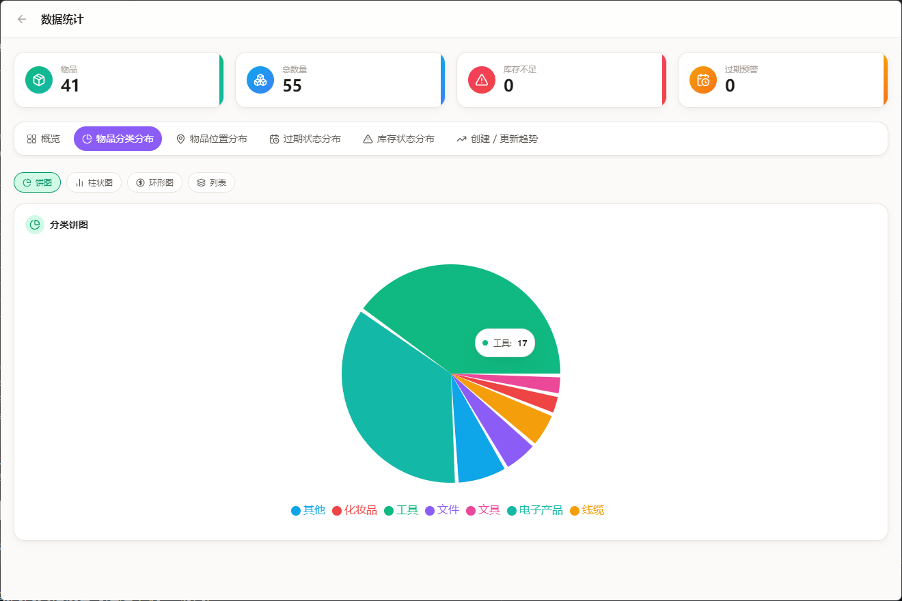
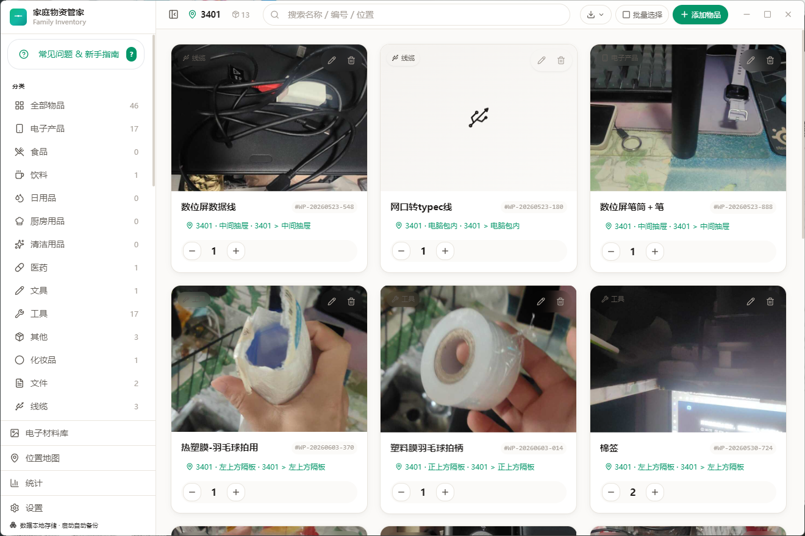
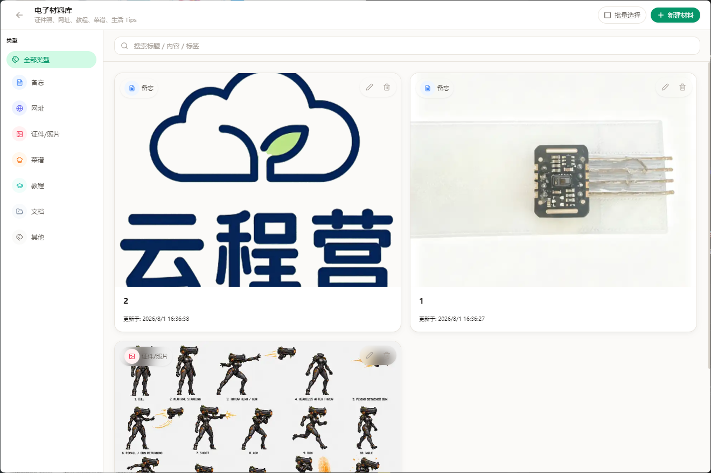
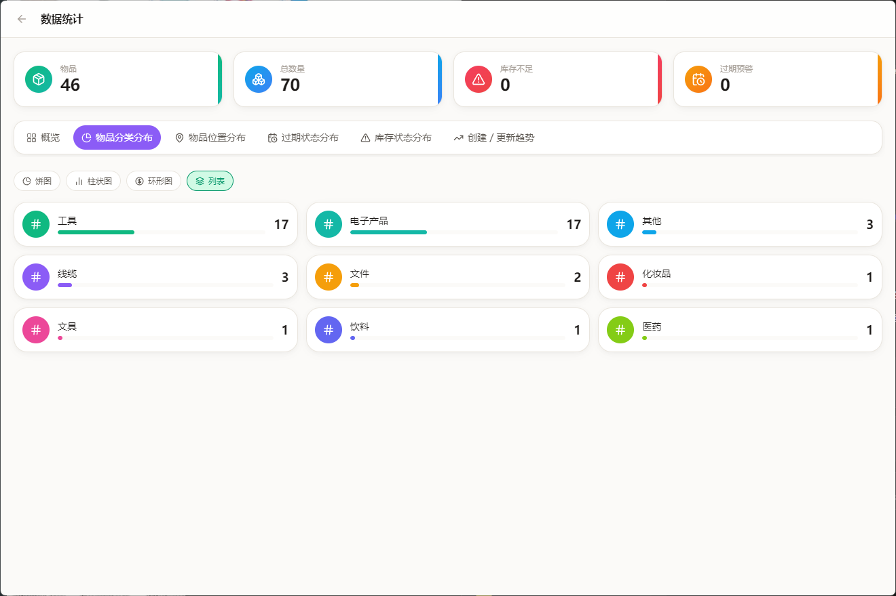
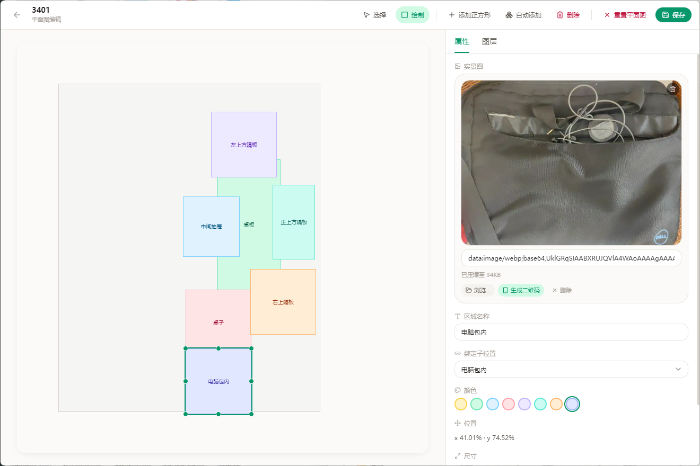
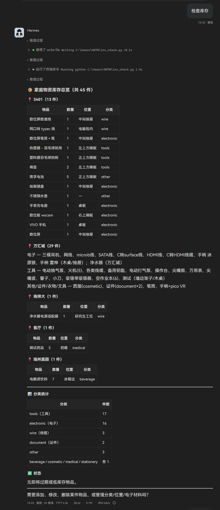
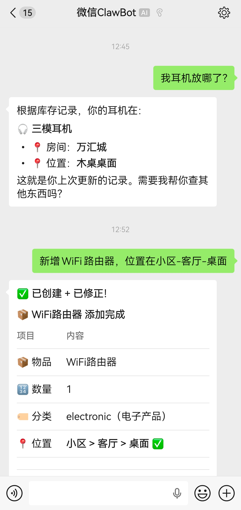

<div align="center">

# 家庭物资管家 · Family Inventory

<p align="center">
  
  <br/>
  <sub>一个知道你家里还有什么、放在哪、够不够用的小工具</sub>
</p>

> *「家里的东西，本该心中有数。」*

[](LICENSE)
[](#下载安装)
[](https://github.com/xc2331/inventory-desktop--/releases)
[](https://www.electronjs.org/)

<br>

**轻量本地化的家庭物品管理桌面应用** —— 物品、分类、位置、库存、过期提醒一站式管理，所有数据本地存储，离线可用，JSON 导出与手机端 H5 版本结构兼容。

<sub>支持 Windows / macOS / Linux，数据文件可放在 U 盘或同步盘，走到哪管到哪。</sub>

<br>

[看效果](#效果示例) · [功能演示](#功能演示) · [下载安装](#下载安装) · [核心功能](#核心功能) · [Agent API](#agent-外部接口) · [自己构建](#开发与构建)

</div>

---

## 效果示例

```
用户      ❯ 冰箱里还剩什么快过期的？

应用      ❯ 冰箱中共有 12 件物品，其中 2 件需要关注：
           · 牛奶 — 3 天后过期，剩余 1 盒
           · 酸奶 — 已过期 2 天，建议清理
```

```
用户      ❯ 帮我记一下，阳台工具箱新增一把锤子

应用      ❯ 已添加「锤子」到「阳台 > 工具箱」，
           编号 TY-20260115-003，当前库存 1。
```

主界面采用无边框窗口 + 顶栏工具栏一体化设计，侧边栏可折叠，卡片悬浮放大，双击图片即可全屏查看。

<div align="center">
  
  <br/>
  <sub>界面预览：分类 · 位置 · 过期 · 库存 · 趋势 · 数量 多维统计</sub>
</div>

---

## 功能演示

下面用几张实际使用截图，带你快速了解这款软件能做什么。

### 1. 主界面：一眼看清家里有什么

左侧分类和位置树用来筛选，中间是物品卡片。每张卡片显示照片、名称、编号、位置和数量，点 `+` / `-` 就能直接改数量。

<div align="center">
  
  <br/>
  <sub>主界面：分类筛选 + 物品卡片 + 快捷数量调整</sub>
</div>

### 2. 电子材料库：教程、网址、证件照一起管

不只是实物，软件还支持管理电子资料：网址收藏、教程、菜谱、证件照、文档……按类型筛选，支持大图查看和批量编辑。

<div align="center">
  
  <br/>
  <sub>电子材料库：证件照、网址、教程、菜谱等分类管理</sub>
</div>

### 3. 数据统计：家里东西多不多、缺什么一目了然

统计页用饼图、柱状图、环形图、趋势折线、雷达图等方式展示：分类分布、位置分布、过期/库存预警、创建更新趋势、物品数量分布。

<div align="center">
  
  <br/>
  <sub>数据统计：分类、位置、过期、库存、趋势多维可视化</sub>
</div>

### 4. 平面图编辑器：画出房间布局，定位更直观

进入「位置地图 → 编辑平面图」，可以拖拽绘制子区域、绑定位置、上传实景图、调整图层顺序。东西放哪，看图就知道。

<div align="center">
  
  <br/>
  <sub>平面图编辑器：拖拽划分子区域、绑定位置、上传实景图</sub>
</div>

### 5. Agent 自然语言查询：问一句就知道

通过外部 Agent API，AI 可以直接读取库存并回答你。例如问「家里有什么」，Agent 会返回按位置整理的清单和分类统计。

<div align="center">
  
  <br/>
  <sub>Agent 查询：按位置汇总物品清单 + 分类统计</sub>
</div>

### 6. 微信聊天也能管库存

配合外部 Agent 或自定义机器人，在微信里直接问「我耳机放哪了？」，或者发一句「新增 WiFi 路由器，位置在小区-客厅-桌面」，它就能自动在软件里创建好物品并同步显示。

<div align="center">
  
  <br/>
  <sub>微信端：查询物品位置 / 语音一句话新增物品</sub>
</div>

### 7. 更多日常用法

```
你      ❯ 收藏一个烘焙教程

应用    ❯ 在「电子材料库 → 教程」里新增一条记录，
         填上标题和网址，下次想烤蛋糕时一搜就有。
```

```
你      ❯ 找出我的身份证照片

应用    ❯ 在「电子材料库」搜索框输入「身份证」，
         类型筛选「证件/照片」，立刻定位到那张证件照。
```

```
你      ❯ 拍照添加这包薯片

应用    ❯ 打开手机扫码传图 → 电脑端收到图片 →
         点「AI 识别」自动识别为「薯片 / 食品」→ 确认后入库。
```

```
你      ❯ 最近有什么要补货的？

应用    ❯ 统计页「库存状态分布」显示：
         卫生纸低于最低库存，洗衣液 7 天内过期。
```

---

## 核心功能

- **物品全生命周期管理**：名称、分类、编号、房间、位置、数量、最低库存、过期日期、图片
- **分类智能归一化**：`tool` / `工具` / `tools` 自动合并，支持 250+ 个分类图标
- **位置树筛选**：房间 / 位置父子层级，快速定位物品在哪
- **位置地图可视化**：按房间查看物品分布，点击房间进入平面图编辑器，拖拽划分子区域
- **平面图编辑器**：拖拽绘制子区域、绑定位置、图层排序、置顶/置底、子区域实景图上传
- **库存与过期预警**：低于最低库存标红，7 天内过期 / 已过期自动提醒
- **数量快捷 ±1**：卡片上直接增减数量，实时同步数据库
- **批量操作**：批量改分类、批量删除
- **图片压缩存储**：本地图片拖拽或浏览后自动压缩为 WebP Base64（≤100KB），与数据一起导出
- **手机扫码传图**：同一局域网内手机扫码后拍照/选图上传到电脑，自动填充物品图片
- **AI 视觉识别**：上传物品图片后点击「AI 识别」，自动给出名称、分类、位置、数量建议，确认后回填
- **电子材料库**：集中管理证件照、网址、教程、菜谱等非实物资料，支持图片/链接/文件路径
- **数据统计页**：分类饼图 / 柱状图、位置分布、过期 / 库存环形图、创建更新趋势折线、数量雷达图
- **外部 Agent API**：启动本地 HTTP 服务，Claude / ChatGPT / Trae 等 Agent 可通过 Token 鉴权管理物品
- **软件内更新**：检查更新、选择下载目录、下载完成后手动确认安装
- **数据自由迁移**：JSON 导入导出、CSV 导出，数据库目录可自定义
- **启动自动备份**：每次启动自动复制 `inventory.db` 为 `inventory.db.backup`

---

## 下载安装

1. 前往 [Releases 页面](https://github.com/xc2331/inventory-desktop--/releases) 下载对应平台安装包
2. **Windows**：双击 `.exe` 运行（便携版，无需安装）
3. **macOS**：打开 `.dmg` 拖入「应用程序」
4. **Linux**：赋予执行权限后运行 `.AppImage`

> 数据文件默认位于系统应用数据目录，可在「设置 → 数据目录」中更改到 U 盘或同步盘。

---

## 界面说明

- **顶栏（单行一体）**：侧边栏切换 + 视图标题 + 搜索框 + 导入导出 / 批量选择 / 添加物品 + 内联统计 + 窗口控制按钮
- **侧边栏**：分类筛选、位置树筛选、位置地图、统计入口、设置入口；收起后仅显示图标
- **位置地图**：按房间展示物品数量卡片，点击房间卡片右侧「编辑平面图」进入平面图编辑器
- **统计页**：分类 / 位置 / 过期 / 库存 / 时间 / 数量 多维数据可视化
- **设置页**：语言、主题、数据目录、Agent API、分类 / 位置管理、导入导出、更新源

---

## 图片存储说明

数据库 `photo` 字段统一存储字符串：

- `data:image/webp;base64,xxxx` —— 内嵌压缩后的图片数据（推荐）
- `https://...` 或相对路径 / 本地路径 —— 在线图片地址或旧版路径

渲染时自动判断前缀：
- 以 `data:` 开头 → 直接作为 `` 显示
- 否则 → 当作 URL 处理

**上传流程**：用户选择/拖拽图片 → 前端 Canvas 压缩（最大 800px、WebP 优先质量 0.6、回退 JPEG）→ 若压缩后 >100KB 则提示重新选择 → 存入 `photo` 字段。

JSON 导入导出时 `photo` 字段原样保留，Base64 图片会自动跟随数据文件迁移。

---

## Agent 外部接口

应用内置本地 HTTP API，允许外部 AI Agent 通过自然语言指令管理家中物品。

### 快速配置

1. 打开应用 →「设置 → 外部 Agent 接口」
2. 自定义服务端口（默认 3001）
3. 按需开启「暴露到局域网」（同一局域网内其他设备可通过本机 IP 访问）
4. 自定义或刷新访问 Token
5. Agent 请求头携带：`Authorization: Bearer <Token>`

### 自然语言 → API 示例

| 用户说 | Agent 请求 |
| --- | --- |
| 帮我看看冰箱里还有什么 | `GET /api/items?keyword=冰箱` |
| 添加 6 盒牛奶到厨房冰箱 | `POST /api/items { name, quantity, category, location: "厨房 > 冰箱" }` |
| 把牛奶数量改成 4 | `GET /api/items/牛奶` → `PATCH /api/items/<id> { quantity: 4 }` |
| 删除过期的面包 | `GET /api/items/面包` → `DELETE /api/items/<id>` |

> 位置字段说明：`location` 优先，使用 `>` 分隔层级（也支持 `/`、`→`）；未传 `location` 时回退到 `room` + `position`。创建/更新成功后，系统会自动把位置同步到「位置地图」和「位置管理」。

更完整的接口规范、字段说明与 Skill 文件见 [`docs/agent-api.md`](./docs/agent-api.md) 与 [`skills/family-inventory-agent.md`](./skills/family-inventory-agent.md)。

---

## 开发与构建

### 环境要求

- Node.js >= 18
- npm >= 9

### 安装依赖

```bash
npm install
```

> 安装后会自动执行 `electron-builder install-app-deps`，为 Electron 重新编译 `better-sqlite3` 原生模块。若失败，可手动执行 `npm run rebuild`。

### 开发模式

```bash
npm run dev
```

### 打包

```bash
npm run build:win    # Windows (portable exe)
npm run build:mac    # macOS (dmg)
npm run build:linux  # Linux (AppImage)
```

产物输出到 `release-v19-vXXX/` 目录（版本号递增的独立目录）。

### 发布到 GitHub / Gitee Releases

```bash
npm run publish:github   # 需要 GH_TOKEN
npm run publish:gitee    # 需要 GITEE_TOKEN
npm run publish:all      # 两个都发布
```

> 可在项目根目录创建 `.env.local` 文件存放 `GH_TOKEN` 和 `GITEE_TOKEN`，发布脚本会自动读取（该文件已被 .gitignore 忽略，不会提交）。

### 国内网络加速（可选）

```powershell
# PowerShell
$env:ELECTRON_MIRROR="https://npmmirror.com/mirrors/electron/"
$env:ELECTRON_BUILDER_BINARIES_MIRROR="https://npmmirror.com/mirrors/electron-builder-binaries/"
```

---

## 项目结构

```
inventory-desktop/
├── build/                    # 应用图标
├── docs/                     # 接口文档
├── electron/                 # 主进程（窗口、数据库、IPC、API 服务、更新器）
├── scripts/                  # 构建与发布脚本
├── skills/                   # Agent Skill 文件
├── src/
│   ├── components/           # React 组件
│   ├── lib/                  # API 封装、国际化、图标、工具函数
│   ├── App.jsx               # 主应用
│   └── index.css             # Tailwind + 设计令牌
├── index.html
├── package.json
├── tailwind.config.js
└── vite.config.js
```

---

## 最近更新

- **v1.7.2**：SQL 通用通道改精确语句白名单（危险语句真正被拒 + 交叉验证测试）；生产环境恢复同源策略；UI 与 Agent 物品写入收敛到 `services/items` 单一事务实现（消除双写漂移，保存不再全表 rebuild）；拖拽排序持久化到 `items.sort_order` 列（替代 localStorage 绝对下标）；JSON 导入支持合并模式；Agent API 请求体上限 + Token 常量时间比较；传图服务 15MB 上限 + 二维码 10 分钟自动过期；更新器仅 https；拖拽把手支持方向键交换（可达性）；骨架屏纯 CSS 化；回滚未使用的 Zustand store
- **v1.7.1**：修复 v1.7.0 启动崩溃（main.jsx useEffect 未导入，附全量 hook 导入扫描防再犯）；渲染进程启动信标便于冒烟验证；切换数据目录后同步 Agent API 数据库引用+失败回滚；数量增减负数保护；删除物品 5 秒内可「撤销」；步进器长按连击；密度切换改显式三段选择器；过期通知按物品 id 记忆；AI 识别分类归一化复用唯一实现
- **v1.7.0**：图片显示链路根治（preload `app` 未定义 → `sendSync` 同步 dataDir）；数据库损坏恢复链接通（启动滚动备份 `backups/*.bak` 保留 7 份 + 旧版备份回退）；列表加载失败降级 toast 不再全屏报错；`photo:saveFile` 路径批准列表封堵任意文件外泄；拖拽排序加固（pointercancel/Esc/卸载清理 + 实时放置目标高亮）；「关闭动画」设置真正接管 framer-motion（MotionConfig reducedMotion）；过期预警页修复分类显示/圆点颜色 bug 并整页 i18n 化；暗色启动白闪根治（theme-boot.js 首帧前设置 dark 类）；通知轮询/统计预热/预警页改用轻量元数据查询（不再全量序列化 photo 大字段）；清理死代码
- **v1.6.5**：测试基础设施完善（Vitest 单测 50 用例通过）；SQL 单入口 core/db/query.js
- **v1.6.4**：批量编辑数量弹窗视口边界检测，超出右边界时自动右对齐，分类/数量弹窗统一处理
- **v1.6.3**：批量编辑弹窗点击无显示修复（createPortal 竞态消除 + CSS transition 动画）
- **v1.6.2**：批量编辑分类/数量弹窗层级修复（createPortal 渲染到 document.body + fixed + zIndex:9999）
- **v1.6.1**：修复双击 QR 图片预览异常（ItemCard 传递 displayUrl 而非 photoUrl）；批量编辑分类/数量弹窗方向修正（bottom-full→top-full 向下展开）
- **v1.6.0**：满9进1版本汇总；README changelog 排序修复；todo-list 清理
- **v1.5.9**：深度修复 QR 扫码图片不显示（ItemCard readPhoto 兜底后清除 imgErr；photo:read 自动匹配 MIME 类型）；新增诊断脚本
- **v1.5.8**：深度修复物品图片不显示（QR 扫码/粘贴/浏览/拖拽四入口全覆盖），photo.url() 增加 IPC 兜底 + 调试日志
- **v1.5.7**：修复 TDZ 白屏（ItemCard photoUrl 声明顺序）；AI 识别逐字段应用；图片预览即时反馈
- **v1.5.6**：AI 识别逐字段应用修复；图片预览即时反馈
- **v1.5.5**：物品图片「浏览」入口上传后保存加载不显示修复；AI 识别白屏修复
- **v1.5.4**：AI 识别白屏修复（FieldOption 内 t() 未定义）
- **v1.5.3**：物品图片上传后不显示修复；编辑/新增物品入场动画增强；深色模式对比度增强
- **v1.5.2**：深色模式对比度增强；数据库损坏自动备份+恢复
- **v1.5.1**：导出 JSON 防特殊字符崩溃（sanitizeFilename）
- **v1.5.0**：侧栏展开/收起平滑过渡（UX-13）+ 分类表单分组（UX-14）+ 斑马纹（UX-15）+ 抽屉动画撤回（UX-16）+ 上传进度（UX-17）批量上线
- **v1.4.13**：图片上传进度指示器（UX-17）：粘贴/浏览/扫码四入口接入上传进度
- **v1.4.12**：编辑面板抽屉动画（UX-16）：用户反馈撤回，恢复全屏淡入淡出
- **v1.4.11**：主表格斑马纹 + 行悬停高亮（UX-15）
- **v1.4.10**：侧栏平滑过渡（UX-13）+ 分类创建/编辑表单分组（UX-14）
- **v1.4.9**：统计图表切换动效（UX-12）：柱状/饼图渐变填充入场
- **v1.4.8**：过期预警列表（UX-11）：按紧迫度分级（critical/urgent/warning）+ 三种排序（紧迫度/日期/名称）+ 关键词搜索 + 已过期筛选
- **v1.4.x**：UX-11~17 批量上线批次
- **v1.3.16**：图片预览缩放增强（UX-10）：双击图片切换缩放级别（1x→2x→3x→1x）、滚轮缩放（0.5x~4x）、键盘 ←→↑↓ 平移、触屏双指捏合、缩放后显示百分比 + 重置按钮 + 操作提示
- **v1.3.15**：Toast 点击定位（UX-09）：新增/编辑物品后的 Toast 点击可滚动到对应卡片并高亮 1.4s，非物品类 Toast 行为不变
- **v1.3.14**：位置树展开/收起动画优化（UX-08）：`Sidebar` 与 `ItemForm` 位置树节点改为 ease-out 曲线 + staggered 子项入场，从左侧滑入并渐显
- **v1.3.13**：搜索结果关键词高亮（UX-07）：电子材料库卡片标题和正文也接入 `<mark>` 黄色高亮，与物品列表搜索体验统一
- **v1.3.12**：批量操作面板拖拽排序（UX-06）：顶部拖拽排序预览条，最多显示 8 张迷你卡片；松开即按新顺序排列；支持中英双语
- **v1.3.11**：表单校验即时反馈（UX-05）：核心字段 blur 触发校验 + 错误清除 + 错误提示弹性动效 + 字段抖动 + 边框高亮
- **v1.3.10**：空状态插画升级（UX-04）：`EmptyState` 加入入场动画 + 装饰光晕背景 + 弹性图标框 + CTA 按钮弹簧交互
- **v1.3.9**：加载骨架屏（UX-03）：新增 `SkeletonCard` 替换 "Loading..." 文字，模拟卡片轮廓 + shimmer 流光呼吸动画
- **v1.3.8**：物品卡片拖拽预览（UX-02）：非照片卡片支持拖拽，抬起缩放 + 旋转 + 深阴影，松手弹簧回弹
- **v1.3.7**：物品卡片交互反馈（UX-01）：悬停抬起阴影加深 + 按压回弹 + 键盘焦点环 + 选中脉冲呼吸环
- **v1.3.6**：修复 AI 视觉 API 配置保存白屏：`electron/main.js` 缺失 `ai-service` 模块导入，`migrateAIConfig` 等函数未定义
- **v1.3.5**：AI 配置保存异常防护（try-catch 捕获后端错误，UI 显示提示而非白屏）
- **v1.3.4**：过期徽章英文 i18n 修复；`?` 快捷键排除输入框聚焦状态；搜索无结果空状态优化
- **v1.3.3**：过期遮罩重设计（柔和渐变 + 半透明）；Toast 通知队列化（最多堆叠 3 条）
- **v1.3.2**：批量设置数量 Bug 修复（`set` 模式更新所有选中项）；幽灵列白名单；暗色模式切换白闪修复；`MotionConfig` 全局配置
- **v1.3.1**：修复电子材料库白屏；全局异步错误监听；材料库、位置图、平面图编辑器 ErrorBoundary 兜底；标签计数胶囊样式；Toast 底部进度条
- **v1.3.0**：家庭食材消耗日志、Agent AI 识别自动入库（含 AI 建议来源字段）、批量导入（物品 + 耗材 + 材料）
- **v1.2.16**：设置页重新排序：「数据管理」置顶，「更新日志 / 新功能」置底
- **v1.2.15**：修复 UI 创建/更新物品后新位置/新分类未自动同步；AI 视觉识别配置支持多供应商
- **v1.2.14**：Agent 接口创建/更新物品位置与分类同步修复；位置解析支持多种分隔符并自动去空格
- **v1.2.13**：Agent 外部接口分类和位置同步修复；设置新增「重建分类与位置」按钮
- **v1.2.12**：平面图编辑器属性面板重做：实景图置顶并按原比例显示；面板宽度 480px 支持拖拽；属性与图层标签页
- **v1.2.11**：恢复默认打开主物品列表；生产构建不再自动打开 DevTools；修复平面图编辑器选中子区域时报错
- **v1.2.10**：平面图编辑器点击子区域时删除绑定位置的防御；bindLocationId 查找增加空值防御
- **v1.2.9**：位置地图及平面图编辑器白屏修复；错误边界、数据加载空值防御；右侧抽屉动画优化
- **v1.2.8**：软件内更新支持取消下载、下载前选择目录、下载完成提示路径
- **v1.2.7**：版本号升级用于测试更新流程
- **v1.2.6**：AI 自动获取模型列表、电子材料库大图展示、返回白屏修复
- **v1.2.5**：AI 视觉识别、外部 Agent `/api/ai/recognize` 接口
- **v1.2.4**：托盘单实例启动、平面图图层遮盖与实景图、AI 视觉识别后端预置
- **v1.2.3**：手机扫码传图压缩优化、平面图编辑器交互修复
- **v1.2.2**：二维码服务修复、表单 Ctrl+V 粘贴图片、电子材料库大图查看
- **v1.2.1**：frameless 无边框窗口、Agent 接口同步、电子材料库批量编辑
- **v1.2.0**：电子材料库、位置地图、手机扫码传图、外部 Agent API、软件内更新

---

## License

[MIT](./LICENSE)
