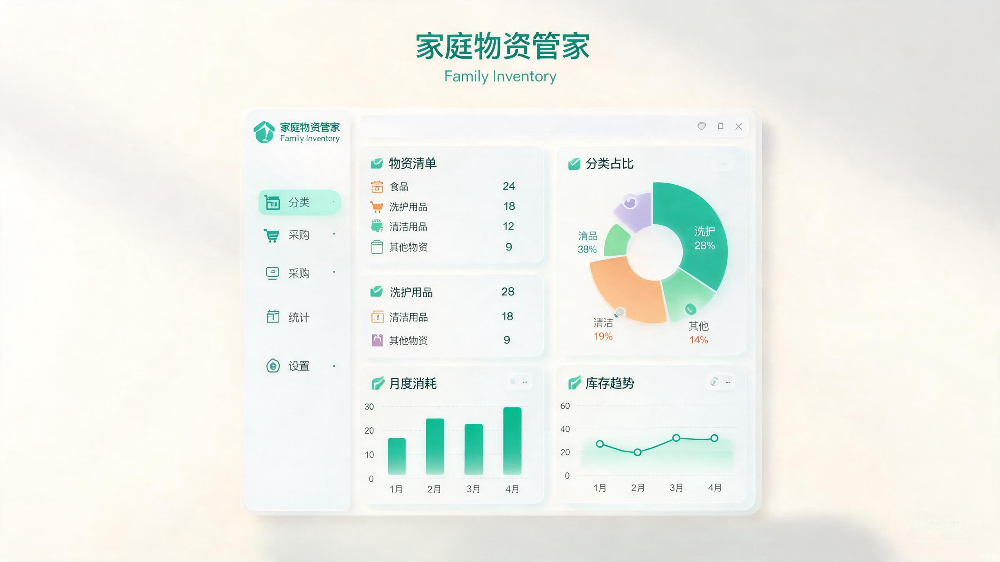

<div align="center">

# 家庭物资管家 · Family Inventory

<p align="center">
  
  <br/>
  <sub>一个知道你家里还有什么、放在哪、够不够用的小工具</sub>
</p>

> *「家里的东西，本该心中有数。」*

[](LICENSE)
[](#下载安装)
[](https://github.com/xc2331/inventory-desktop--/releases)
[](https://www.electronjs.org/)

<br>

**轻量本地化的家庭物品管理桌面应用** —— 物品、分类、位置、库存、过期提醒一站式管理，所有数据本地存储，离线可用，JSON 导出与手机端 H5 版本结构兼容。

<sub>支持 Windows / macOS / Linux，数据文件可放在 U 盘或同步盘，走到哪管到哪。</sub>

<br>

[看效果](#效果示例) · [下载安装](#下载安装) · [核心功能](#核心功能) · [Agent API](#agent-外部接口) · [自己构建](#开发与构建)

</div>

---

## 效果示例

```
用户      ❯ 冰箱里还剩什么快过期的？

应用      ❯ 冰箱中共有 12 件物品，其中 2 件需要关注：
           · 牛奶 — 3 天后过期，剩余 1 盒
           · 酸奶 — 已过期 2 天，建议清理
```

```
用户      ❯ 帮我记一下，阳台工具箱新增一把锤子

应用      ❯ 已添加「锤子」到「阳台 > 工具箱」，
           编号 TY-20260115-003，当前库存 1。
```

主界面采用无边框窗口 + 顶栏工具栏一体化设计，侧边栏可折叠，卡片悬浮放大，双击图片即可全屏查看。

<div align="center">
  
  <br/>
  <sub>界面预览：分类 · 位置 · 过期 · 库存 · 趋势 · 数量 多维统计</sub>
</div>

---

## 核心功能

- **物品全生命周期管理**：名称、分类、编号、房间、位置、数量、最低库存、过期日期、图片
- **分类智能归一化**：`tool` / `工具` / `tools` 自动合并，支持 250+ 个分类图标
- **位置树筛选**：房间 / 位置父子层级，快速定位物品在哪
- **库存与过期预警**：低于最低库存标红，7 天内过期 / 已过期自动提醒
- **数量快捷 ±1**：卡片上直接增减数量，实时同步数据库
- **批量操作**：批量改分类、批量删除
- **图片压缩存储**：本地图片拖拽或浏览后自动压缩为 WebP Base64（≤100KB），与数据一起导出
- **数据统计页**：分类饼图 / 柱状图、位置分布、过期 / 库存环形图、创建更新趋势折线、数量雷达图
- **外部 Agent API**：启动本地 HTTP 服务，Claude / ChatGPT / Trae 等 Agent 可通过 Token 鉴权管理物品
- **数据自由迁移**：JSON 导入导出、CSV 导出，数据库目录可自定义
- **启动自动备份**：每次启动自动复制 `inventory.db` 为 `inventory.db.backup`

---

## 下载安装

1. 前往 [Releases 页面](https://github.com/xc2331/inventory-desktop--/releases) 下载对应平台安装包
2. **Windows**：双击 `.exe` 运行（便携版，无需安装）
3. **macOS**：打开 `.dmg` 拖入「应用程序」
4. **Linux**：赋予执行权限后运行 `.AppImage`

> 数据文件默认位于系统应用数据目录，可在「设置 → 数据目录」中更改到 U 盘或同步盘。

---

## 界面说明

- **顶栏（单行一体）**：侧边栏切换 + 视图标题 + 搜索框 + 导入导出 / 批量选择 / 添加物品 + 内联统计 + 窗口控制按钮
- **侧边栏**：分类筛选、位置树筛选、统计入口、设置入口；收起后仅显示图标
- **统计页**：分类 / 位置 / 过期 / 库存 / 时间 / 数量 多维数据可视化
- **设置页**：语言、主题、数据目录、Agent API、分类 / 位置管理、导入导出

---

## 图片存储说明

数据库 `photo` 字段统一存储字符串：

- `data:image/webp;base64,xxxx` —— 内嵌压缩后的图片数据（推荐）
- `https://...` 或相对路径 / 本地路径 —— 在线图片地址或旧版路径

渲染时自动判断前缀：
- 以 `data:` 开头 → 直接作为 `` 显示
- 否则 → 当作 URL 处理

**上传流程**：用户选择/拖拽图片 → 前端 Canvas 压缩（最大 800px、WebP 优先质量 0.6、回退 JPEG）→ 若压缩后 >100KB 则提示重新选择 → 存入 `photo` 字段。

JSON 导入导出时 `photo` 字段原样保留，Base64 图片会自动跟随数据文件迁移。

---

## Agent 外部接口

应用内置本地 HTTP API，允许外部 AI Agent 通过自然语言指令管理家中物品。

### 快速配置

1. 打开应用 →「设置 → 外部 Agent 接口」
2. 自定义服务端口（默认 3001）
3. 按需开启「暴露到局域网」（同一局域网内其他设备可通过本机 IP 访问）
4. 自定义或刷新访问 Token
5. Agent 请求头携带：`Authorization: Bearer <Token>`

### 自然语言 → API 示例

| 用户说 | Agent 请求 |
| --- | --- |
| 帮我看看冰箱里还有什么 | `GET /api/items?keyword=冰箱` |
| 添加 6 盒牛奶到厨房冰箱 | `POST /api/items { name, quantity, category, room, position }` |
| 把牛奶数量改成 4 | `GET /api/items/牛奶` → `PATCH /api/items/<id> { quantity: 4 }` |
| 删除过期的面包 | `GET /api/items/面包` → `DELETE /api/items/<id>` |

更完整的接口规范、字段说明与 Skill 文件见 [`docs/agent-api.md`](./docs/agent-api.md) 与 [`skills/family-inventory-agent.md`](./skills/family-inventory-agent.md)。

---

## 开发与构建

### 环境要求

- Node.js >= 18
- npm >= 9

### 安装依赖

```bash
npm install
```

> 安装后会自动执行 `electron-builder install-app-deps`，为 Electron 重新编译 `better-sqlite3` 原生模块。若失败，可手动执行 `npm run rebuild`。

### 开发模式

```bash
npm run dev
```

### 打包

```bash
npm run build:win    # Windows (portable exe)
npm run build:mac    # macOS (dmg)
npm run build:linux  # Linux (AppImage)
```

产物输出到 `release-v4f/` 目录。

### 国内网络加速（可选）

```powershell
# PowerShell
$env:ELECTRON_MIRROR="https://npmmirror.com/mirrors/electron/"
$env:ELECTRON_BUILDER_BINARIES_MIRROR="https://npmmirror.com/mirrors/electron-builder-binaries/"
```

---

## 项目结构

```
inventory-desktop/
├── build/                    # 应用图标
├── docs/                     # 接口文档
├── electron/                 # 主进程（窗口、数据库、IPC、API 服务）
├── skills/                   # Agent Skill 文件
├── src/
│   ├── components/           # React 组件
│   ├── lib/                  # API 封装、国际化、图标、工具函数
│   ├── App.jsx               # 主应用
│   └── index.css             # Tailwind + 设计令牌
├── index.html
├── package.json
├── tailwind.config.js
└── vite.config.js
```

---

## 最近更新

- 新增「数据统计页」：分类 / 位置 / 过期 / 库存 / 时间 / 数量 多维炫酷图表
- 图片上传改为前端 Canvas 压缩 + Base64 内嵌存储，单图 ≤100KB
- 分类图标池扩展至 250+，覆盖更多生活场景
- Agent API 支持自定义端口、局域网暴露开关、自定义 Token
- Lightbox 大图查看仅保留关闭按钮，界面更干净
- frameless 无边框窗口，顶栏工具栏一体化

---

## License

[MIT](./LICENSE)
